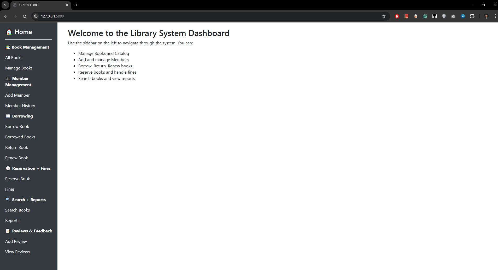
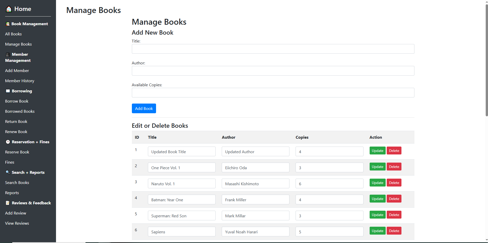
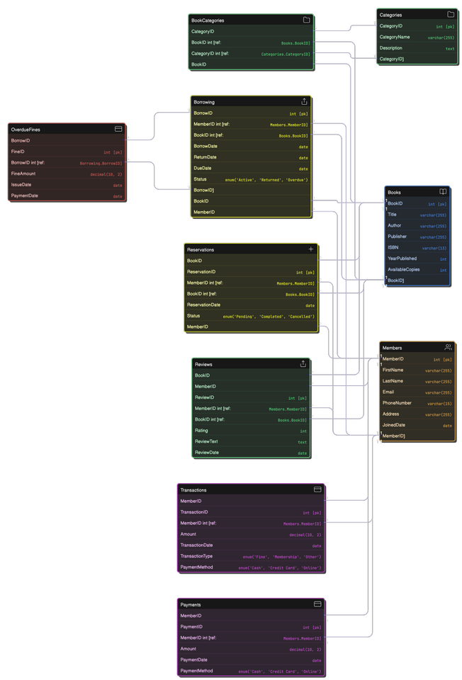

# 📚 Library Management System (Hybrid SQL + NoSQL Project)

## 🔍 About This Project

This is a full-stack library management system built as a semester-long academic project.  
It allows librarians to manage books, members, borrowing, returns, fines, and analytics — all through a Flask-based web application with a clean sidebar interface.

It uses **MySQL** for core relational data (Books, Members, Borrowing, etc.) and **MongoDB** to handle flexible user-generated content like **book reviews** — showcasing a hybrid database design.

---

## 🚀 Key Features

- 📘 Borrow and return books with real-time inventory updates  
- 📌 Reserve unavailable books and track active reservations  
- 💰 Calculate overdue fines and display member payment status  
- 🔁 Renew books with auto-adjusted due dates  
- ➕ Add and manage books and members  
- ✍️ Store and display user book reviews using **MongoDB**  
- 📊 Built-in reporting: most borrowed books, total fines, and active loans  
- 🧩 Web interface built with Flask + Bootstrap for librarian-friendly navigation

---

## ⚙️ Tech Stack

- **Frontend:** HTML, Bootstrap, Jinja Templates  
- **Backend:** Python Flask  
- **Database:** MySQL (LibraryDB) + MongoDB (LibraryNoSQL)  
- **Tools:** MySQL Workbench, MongoDB Compass

---

## 📷 Screenshots

 
 

---

## 🎓 Team Credits

Developed by:

- Grant Latham  
- Alex Beltran  
- Amelia Conley  
- Hamza Ahmed  
- Soumya Dhulipala  
- Zuhayr Chowdhury

---

## 📎 Optional Links

- 🔗 [Demo Video](https://www.youtube.com/watch?v=-KGUROvppPQ&ab_channel=ZuhayrChowdhury)  
- 📝 [Presentation Slides](https://www.canva.com/design/DAGmd-AeoLk/pt7kD2Cd0NLZ-nUziN0blg/edit?utm_content=DAGmd-AeoLk&utm_campaign=designshare&utm_medium=link2&utm_source=sharebutton)

---

